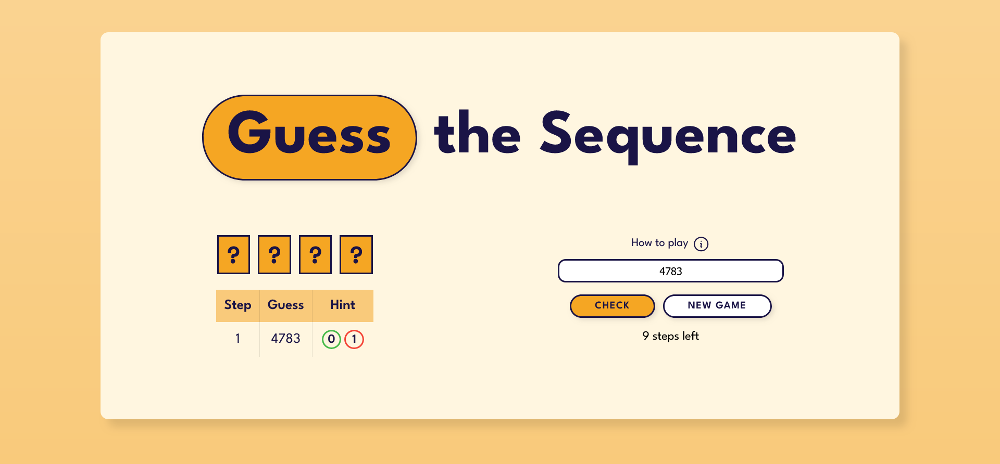

# 🎮 Web Games Collection | Kolekce webových her

:cz: [Česky](#cesky) | :gb: [English](#english)

## Česky

Toto je můj osobní projekt: webová stránka, kde tvořím a sbírám malé webové hry. Slouží jako hřiště pro procvičování webového vývoje a zároveň jako portfolio pro ukázku mých dovedností. Na hlavní stránce najdete seznam všech dostupných her.

Projekt byl v dubnu 2026 přepsán pomocí Reactu. Původní verze ve vanilla JavaScriptu je uložená ve větvi backup-vanilla.

## Live ukázka

Projekt je nasazen na platformě Netlify a je dostupný [zde](https://games-ppopova.netlify.app).

---

## Všechny hry

### 🔢 Guess the Sequence (Uhádni sekvenci)

Logická hra, kde je cílem hráčů rozluštit skrytý čtyřmístný kód pomocí strategické zpětné vazby.

- Deklarativní UI: znovupoužitelné komponenty Reactu vytvořené rozdělením komplexních UI prvků (tabulky tipů, popupy, výsledkové zprávy).
- Pokročilá správa stavu (sledování historie tipů, validace vstupu, logika ukončení hry).
- Hook useEffect pro spouštění oslavných efektů a řízení přechodů ve hře (canvas-confetti).
- Validace vstupu v reálném čase pomocí regulárních výrazů.
- Responzivní webdesign (Mobile-First přístup, Flexbox, media queries, jednotky rem, CSS proměnné).

---

#### Screenshot

## 🛠️ Technologie

- React s nástrojem Vite
- JavaScript (ES6+)
- CSS3

## 🚀 Plány do budoucna

- Přidat další hry do kolekce.
- Vylepšit uživatelské rozhraní pomocí animací a celkového vizuálního doladění.

---

## English

This is my personal project: a website where I build and collect small web games.  
It’s both a playground for practicing web development and a portfolio project to showcase my skills.  
The home page lists all available games.

Project was rewritten using React in April 2026. The old vanilla JS version is stored on backup-vanilla branch.

## Live Demo

The project is deployed on Netlify and can be accessed [here](https://games-ppopova.netlify.app).

---

## All Games

### 🔢 Guess the Sequence

A logic-based puzzle game where players must crack a hidden 4-digit code using strategic feedback.

- Declarative UI: React's reusable components made from breaking down complex UI elements (Guess Tables, Popups, Result Messages).
- Advanced state management (guess history tracking, input validation, game-over logic).
- The useEffect hook to trigger celebratory effects and manage game transitions (canvas-confetti).
- Real-time regex-based input validation.
- Responsive web design (Mobile-First approach, Flexbox, Media queries, using rem units, CSS variables).

#### Screenshot

---

## 🛠️ Built With

- React with Vite
- JavaScript (ES6+)
- CSS3

---

## 🚀 Future Plans

- Add more games to the collection.
- Improve the UI with animations and polish.
