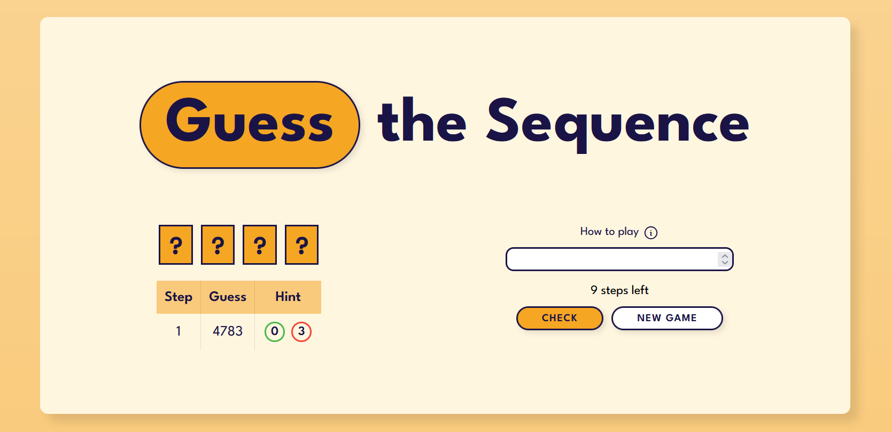

# 🎮 Web Games Collection

This is my personal project: a website where I build and collect small web games.  
It’s both a playground for practicing web development and a portfolio project to showcase my skills.  
The main page (`index.html`) lists all available games.

## Live Demo

The project is deployed on Netlify and can be accessed [here](https://games-ppopova.netlify.app).

---

## All Games

### 🔢 Guess the Sequence

A logic game where the goal is to crack a hidden 4-digit code.

- Dynamic DOM manipulation (adding/removing rows in the guess table, badges for feedback).
- User interaction (popups, hover effects, reset button).
- Responsive web design (Flexbox, Media queries, using rem units, CSS variables).
- Clean code organization (HTML, CSS, JS separated and readable with comments).
- Attention to UX (badges instead of plain text, smooth transitions).
- Integrated external library for celebratory effects (canvas-confetti).

#### Screenshot

---

## 🛠️ Built With

- HTML
- CSS
- JavaScript

---

## 🚀 Future Plans

- Add more games to the collection.
- Improve the UI with animations and polish.
